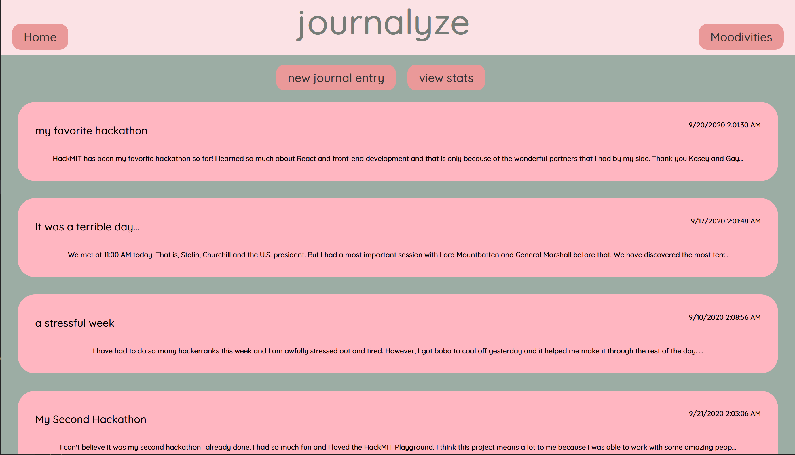
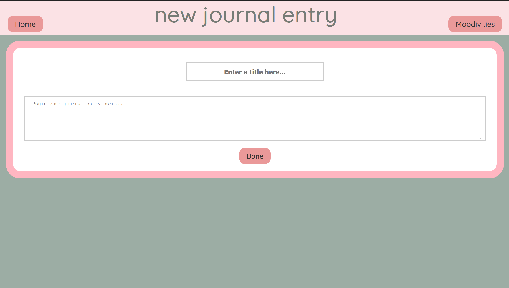
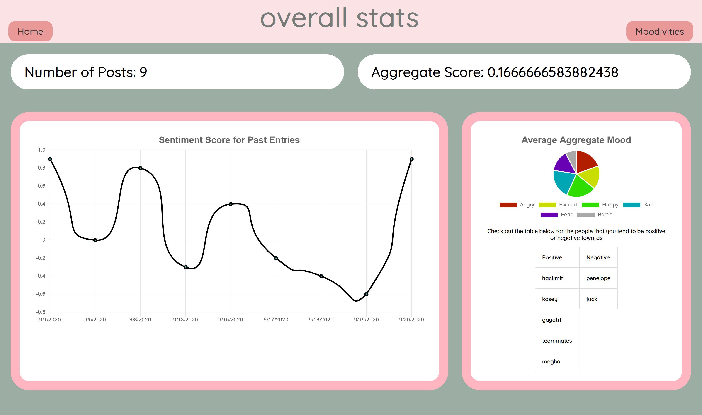
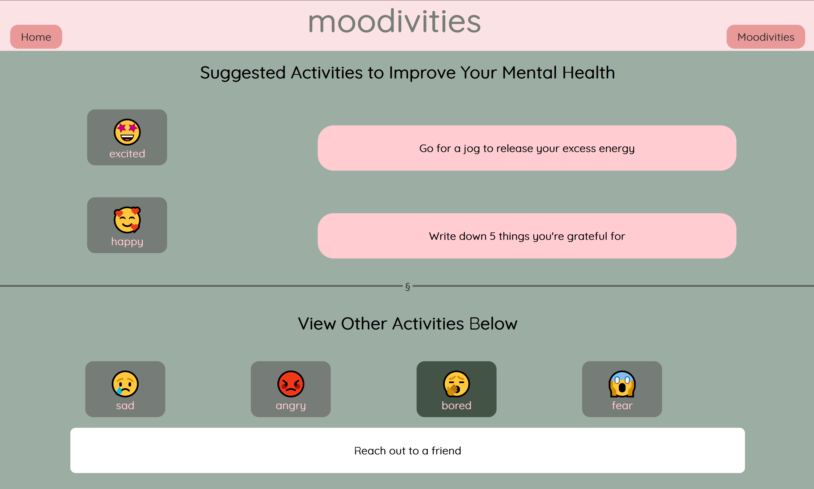

# Journalyze

## Inspiration 
We wanted to create a journal where people can not only write down their thoughts, but be spurred to take action and improve their mental health. By using Natural Language Processing and Sentiment Analysis, we wanted to provide insight into what lies underneath thoughts. 

## Overview
journalyze (journal-analyze) is a personal diary that analyzes your emotions based on your entries and suggests key actions you can take to improve your mental health. You may also view previous entries and their corresponding sentiment scores as well as most prominent emotions. On the stats page, you can view the trend of your mood and which emotions you tend to experience the most. Lastly, you can view the people you feel the most positive or negative towards. Overall, this journal is not just a notebook, but an interactive environment for you to become happier and healthier :)

Home Screen           |  View a Single Entry
:-------------------------:|:-------------------------:
  |  

Create a New Entry            |  View Statistics
:-------------------------:|:-------------------------:
  |  

### Tech Stack
- React.js, HTML, CSS, Javascript
- Node.js, Express.js, MongoDB
- Google Natural Language Processing API Sentiment and Entity Analysis, ParallelDots Emotion API
- Visual Studio Code, GitHub

## Available Scripts

In the project directory, you can run:

### `npm run dev`

Runs the app in the development mode. 
Open [http://localhost:3000](http://localhost:3000) to view it in the browser.

Runs backend on [http://localhost:5000](http://localhost:5000) simultaneously as the server.

